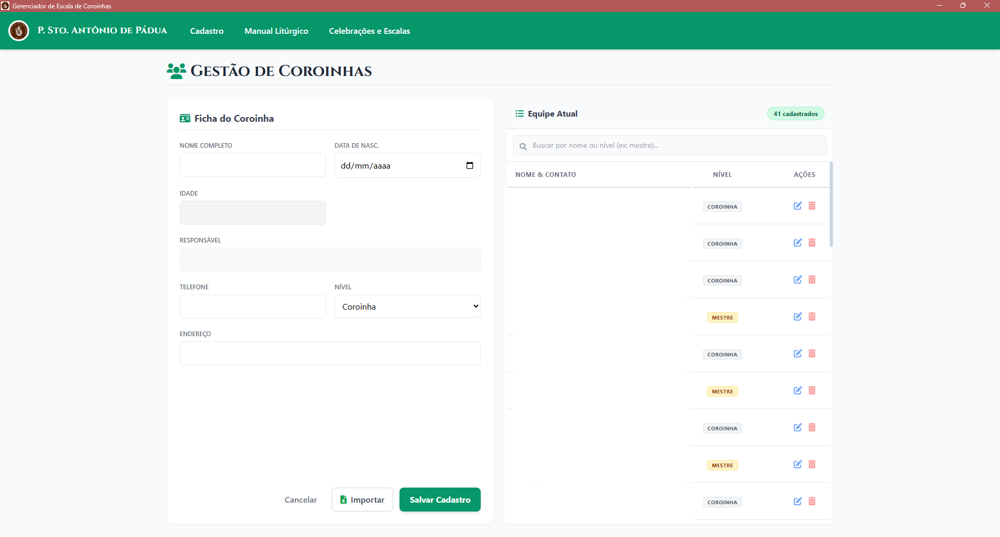
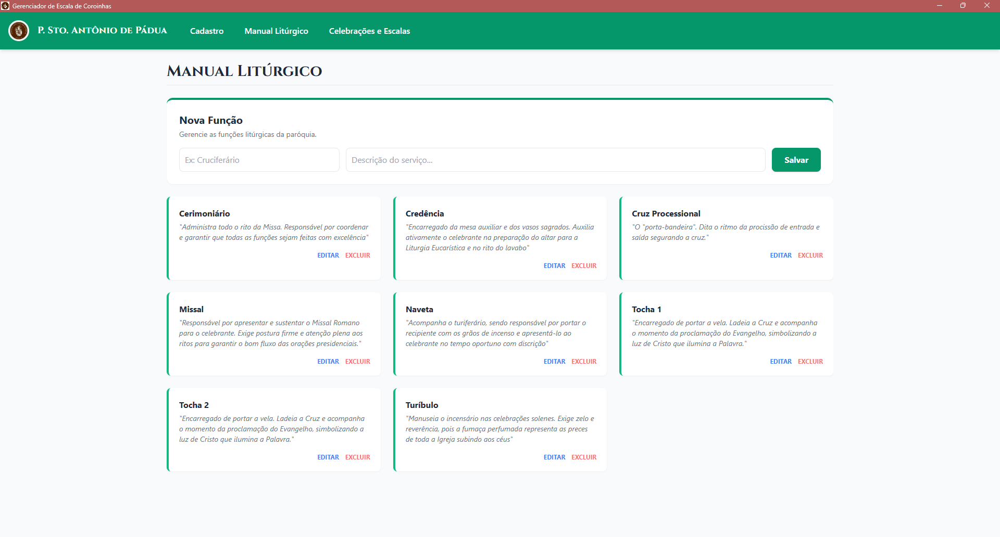
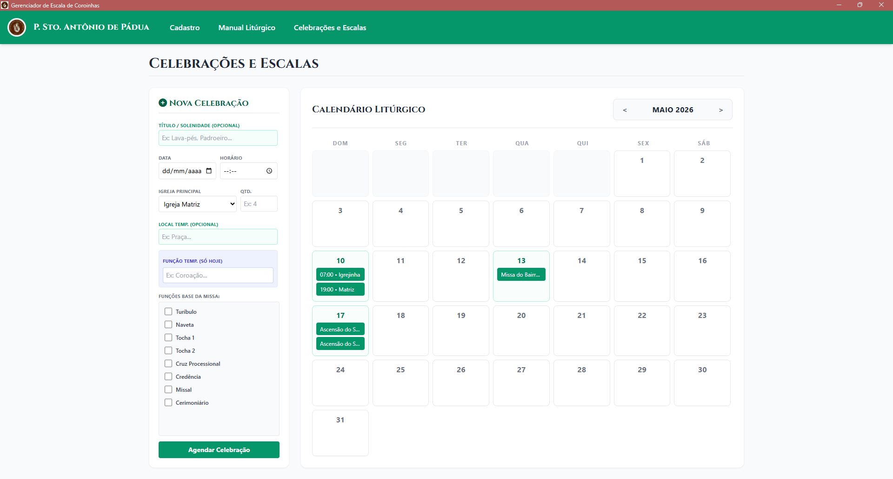
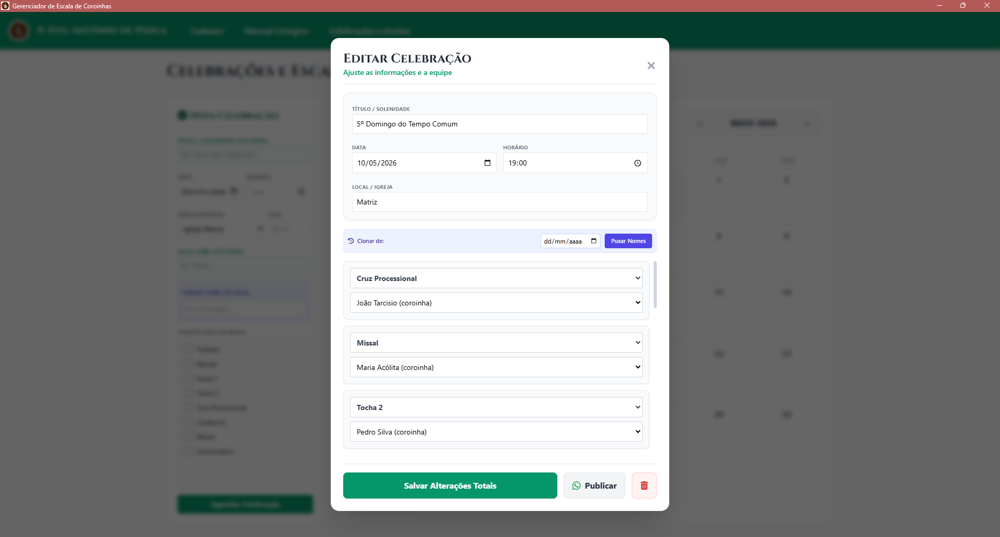

# ⛪ Gerenciador de Escalas Litúrgicas - Paróquia Santo Antônio de Pádua

<div align="center">
  
  <br>
  <i>"Deixai vir a mim as criancinhas..." e deixe a organização das escalas com a tecnologia!</i>
</div>

<br>

<div align="center">
  
  
  
  
</div>

---

## 📖 Sobre o Projeto

Este projeto foi desenvolvido para modernizar e organizar a gestão da equipe de acólitos e coroinhas da **Paróquia Santo Antônio de Pádua (Cariré/CE)**. 

Montar escalas manualmente em papel ou planilhas costuma ser um quebra-cabeça demorado. Este software atua como um assistente de desktop que cruza dados de coroinhas, funções litúrgicas e calendários de missas, culminando na **geração automática de cards em formato de imagem** perfeitamente dimensionados para o compartilhamento via WhatsApp.

---

## 🌟 Funcionalidades e Telas

O sistema é dividido em abas modulares para facilitar o dia a dia da coordenação:

### 👥 Gestão de Coroinhas (Cadastro)
Módulo dedicado ao registro da equipe. Permite cadastrar nome, idade, nível (Coroinha ou Mestre), contato do responsável e endereço. Também possui suporte para importação em massa de listas antigas.


### 🕯️ Manual Litúrgico (Funções)
Um dicionário dinâmico onde o coordenador pode cadastrar os serviços do altar (ex: *Turiferário*, *Naveta*, *Cruz Processional*, *Tochas*). Cada função recebe uma descrição que orienta o serviço.


### 📅 Calendário Inteligente e Escalas
Interface de calendário onde as missas são agendadas. O usuário define o horário, a igreja (Matriz, Capelas, etc.) e o sistema cria os espaços (slots) exatos para preencher com os nomes da equipe.


### ✍️ Montagem Dinâmica e Geração de Cards
A tela de edição final da escala. Após selecionar os coroinhas de um menu suspenso para cada função, o clique no botão **"Publicar"** renderiza todo o HTML da escala em um card no formato JPEG, pronto para envio no grupo de mensagens.


---

## 🏗️ Arquitetura e Tecnologias

O sistema foi construído como uma aplicação *Desktop* nativa, utilizando tecnologias web embutidas, garantindo uma interface rica e processamento local ágil. É como ter um site rodando dentro de um navegador invisível, mas com acesso aos arquivos do próprio computador.

* **Frontend (Interface):** * HTML5 e JavaScript Vanilla.
  * **Tailwind CSS:** Utilizado via CDN/Local para estilização responsiva, limpa e rápida.
  * **FontAwesome & Google Fonts:** Para os ícones e tipografia (como a fonte clássica *Cinzel*).
* **Backend (Motor):** * **Node.js** com o framework **Electron**. O Electron cria a janela do aplicativo e gerencia as permissões do sistema operacional Windows.
  * **html2canvas:** Biblioteca essencial que "tira uma foto" do DOM (da tela gerada) e converte em imagem exportável.
* **Banco de Dados (Armazenamento):**
  * **Better-SQLite3:** Banco de dados relacional (SQL) que roda 100% offline. 
  * *Estratégia de Segurança:* O arquivo `.db` é automaticamente criado na pasta oculta do usuário do Windows (`AppData/Roaming`), garantindo que o banco de dados sobreviva a atualizações do software e não seja corrompido acidentalmente.

---

## 🚀 Guia de Instalação e Execução

Para rodar o ambiente de desenvolvimento, editar o código ou compilar uma nova versão, siga o passo a passo abaixo. É preciso ter o **Node.js** e o **Git** instalados na máquina.

### 1. Clonar o Repositório
Abra o terminal e baixe o código-fonte para o seu computador:
```bash
git clone [https://github.com/Snitram12/gerenciador-escala-coroinhas.git](https://github.com/Snitram12/gerenciador-escala-coroinhas.git)